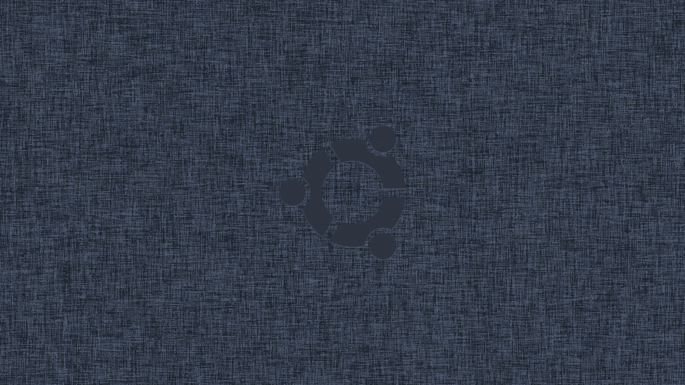

# Nord Image Converter

This script allows you to convert any picture to a nord style. Choose k (from 2 to 5), and specify the input image and output path. Since the image is quantized, blur helps to soften edges of the output image.

## Showcase

<p align="center">
  
  
  
  
</p>

<p align="center">
  
  
</p>

## Used Colors

- `#2e3440` → `(46, 52, 64)`
- `#3b4252` → `(59, 66, 82)`
- `#434c5e` → `(67, 76, 94)`
- `#4c566a` → `(76, 86, 106)`
- `#1D252F` → `(29, 37, 47)`
- `#81A1C1` → `(129, 161, 193)`
- `#ECEFF4` → `(236, 239, 244)`

## Requirements

- Python 3.x
- OpenCV
- NumPy

## Installation

Install the required packages using pip:

```bash
pip install opencv-python-headless numpy
```

## Example use

```
python3 nord_wall.py image.jpg --out out_dir --k 5 --b
```

do

```
python3 nord_wall.py --h
```

for all necessary information about using the script
